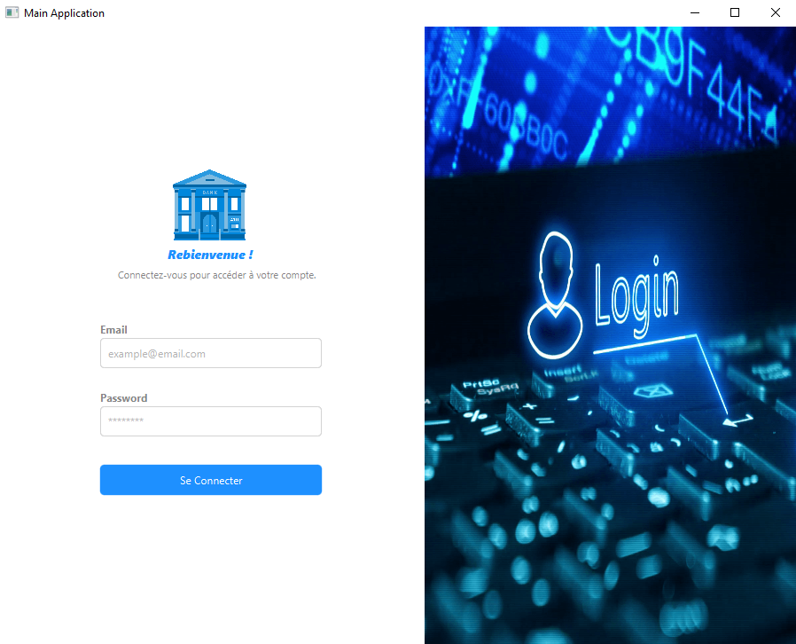
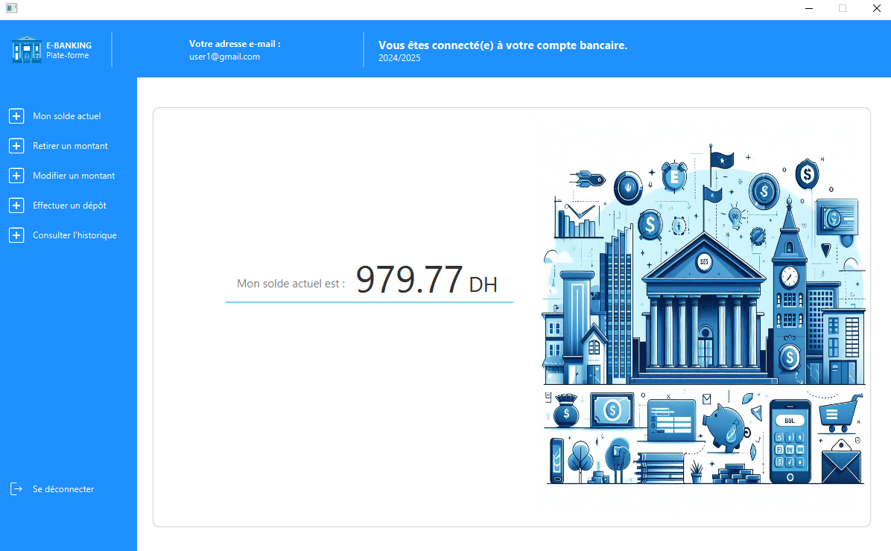
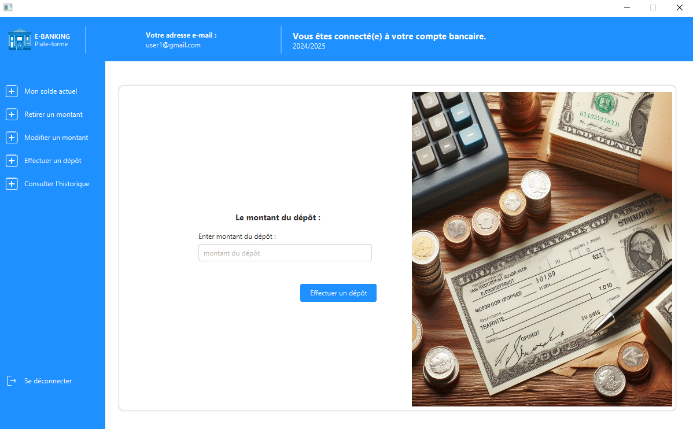
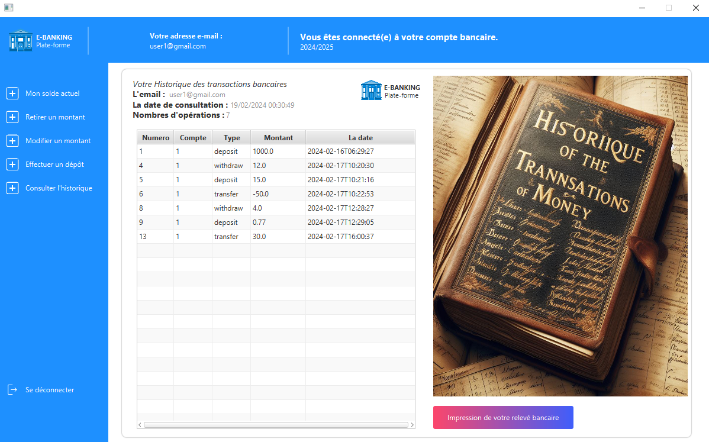
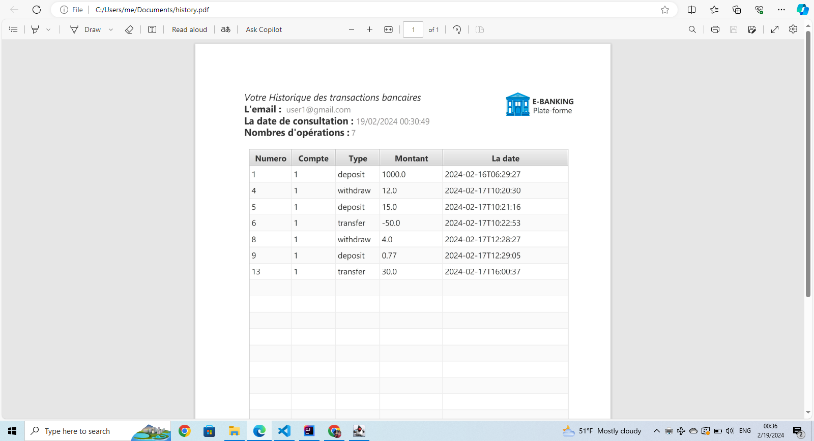

# Client side of E-banking project:
this project created with java and javafx using IntelliJ IDEA,and RMI methode for the connection with backend server to access the database, this is some screenshots of the project :

## 1- Authentication :

## Balancing :
This screen shows the user current balance when opening the app and after each operation this number get updated.

## Deposit UI :
this ui allows the user to make a deposit by entering a number and pressing the button.

## Banking operations history :
this allows the user to see this history of different operation tha happened in his account and he can also print it.

## Example Result pdf of printed banking history:

this is the link of my server side of this project without it this will not work : https://github.com/AyoubELOUAIZI/e-banking-ServerSide-RMI

Thank you for taking the time to explore my project ✅🚀!
